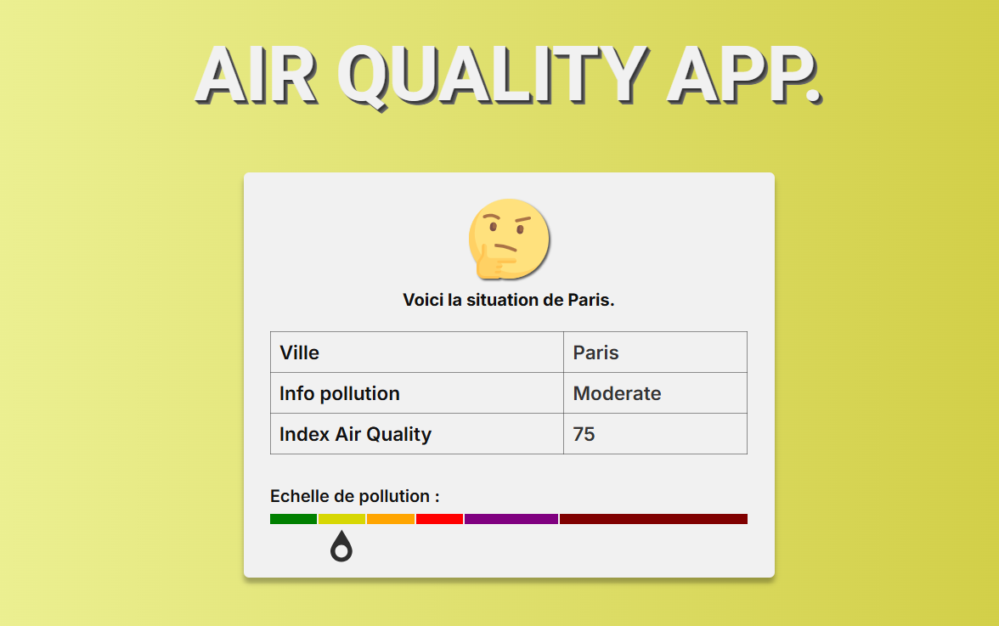

# API Air Quality

Une API simple en HTML, CSS, Javascript permettant de voir la qualité de l'air dans la ville la plus proche.

## Fonctionnalités

- **Affiche dynamiquement la qualité de l'air**
- **Donne une note**

## Technologies utilisées

- **HTML** : Structure de la page
- **JavaScript** : Logique et design de la page
